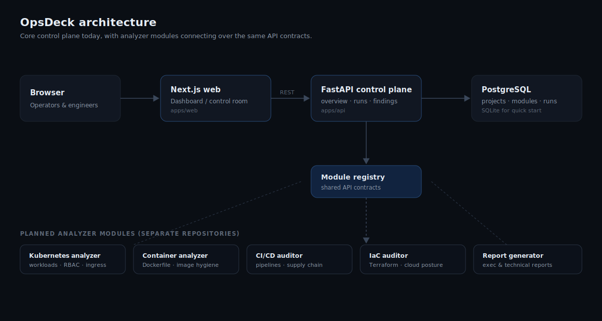

# OpsDeck

OpsDeck is the control plane for a modular DevOps and DevSecOps platform. It is the shared foundation that future analyzer modules — Kubernetes, containers, CI/CD, infrastructure as code, secrets, observability, and reporting — plug into.

This repository is the **core platform** only. It provides the dashboard, the data model, and the API contracts that the rest of the platform is built around.


## What OpsDeck is

A practical control room for platform, SRE, and security teams. It brings together the signals that are normally scattered across CI tools, cluster views, scanner output, and spreadsheets:

- **Projects** — the services and codebases you track.
- **Modules** — the analyzers registered in the platform.
- **Runs** — the history of module executions against projects, each with a score.
- **Findings** — the issues raised by runs, with severity, status, and remediation.
- **Activity** — a feed of recent platform events.
- **Overview** — posture at a glance: totals, average score, and severity distribution.

## What it is not (yet)

OpsDeck does not perform any analysis itself. The Kubernetes analyzer, Dockerfile/container analyzer, CI/CD auditor, and Terraform/IaC auditor are **separate modules** that will be built in their own repositories and connect through the API contracts defined here. Keeping the core thin is deliberate — it stays a clean, neutral place for modules to report into.

## Why it exists

DevOps and security work tends to live in many disconnected tools. OpsDeck is the neutral control plane that aggregates results from independent modules into one model — one place to see what is being scanned, what was found, and what still needs attention.

## Architecture



The browser talks to a Next.js frontend, which calls a FastAPI control plane, which persists to PostgreSQL (or SQLite for a quick local start). Future analyzer modules are independent services that record runs and findings through the same REST contracts.

```
Browser  →  Next.js web  →  FastAPI control plane  →  PostgreSQL
                                     │
                                     └── Module registry  ←  analyzer modules (future repos)
```

## Repository structure

```text
opsdeck-core
├── apps
│   ├── api                  FastAPI control plane
│   │   ├── app
│   │   │   ├── api          HTTP routes
│   │   │   ├── core         settings and shared enums
│   │   │   ├── db           SQLAlchemy engine and session
│   │   │   ├── models       ORM entities
│   │   │   ├── schemas      Pydantic request/response models
│   │   │   └── services     business logic (overview, runs, findings, seed)
│   │   ├── tests            pytest suite
│   │   ├── Dockerfile
│   │   ├── pyproject.toml
│   │   └── requirements.txt
│   └── web                  Next.js dashboard
│       ├── app              App Router pages and states
│       ├── components       UI building blocks
│       ├── lib              API client and formatting
│       ├── Dockerfile
│       └── package.json
├── docs/images             SVG assets used by this README
├── docker-compose.yml
├── .env.example
└── README.md
```

## Tech stack

| Layer    | Technology                                              |
|----------|---------------------------------------------------------|
| Frontend | Next.js 14 (App Router), React 18, TypeScript           |
| Backend  | FastAPI, SQLAlchemy 2.0, Pydantic v2                     |
| Database | PostgreSQL 16 (SQLite fallback for local quick start)   |
| Tooling  | Docker Compose, pytest, ESLint                          |

## Features in this core

- Health and readiness endpoints suitable for container probes
- Platform overview with severity and module-status breakdowns
- Projects, modules, runs, findings, and activity endpoints
- Typed Pydantic schemas and a clean service layer
- Seed data so the dashboard is meaningful on first run
- Multi-page dashboard with loading, empty, and error states
- Responsive dark UI built for a control-room feel
- Docker Compose for the full stack and a pytest suite for the API

## Planned modules

Each of these ships as its own repository and reports into this core:

1. Kubernetes workload analyzer
2. Dockerfile / container analyzer
3. CI/CD pipeline auditor
4. Terraform / IaC auditor
5. Secrets and SBOM module
6. Observability and runbook generator
7. Cloud posture module
8. Report generator

See the in-app **Roadmap** page for the delivery phases.

## Local development with Docker Compose

```bash
cp .env.example .env
docker compose up --build
```

| Service | URL                          |
|---------|------------------------------|
| Web     | http://localhost:3000        |
| API     | http://localhost:8000        |
| Docs    | http://localhost:8000/docs   |
| Health  | http://localhost:8000/health |

Ports can be overridden with `WEB_PORT`, `API_PORT`, and `DB_PORT` in `.env`.

## Manual backend setup

```bash
cd apps/api
python -m venv .venv
# Windows PowerShell: .venv\Scripts\Activate.ps1
source .venv/bin/activate
pip install -r requirements.txt
uvicorn app.main:app --reload --port 8000
```

With no `DATABASE_URL` set, the API uses a local SQLite database (`opsdeck.db`) and seeds it on first start.

## Manual frontend setup

```bash
cd apps/web
npm install
npm run dev
```

The web app reads `NEXT_PUBLIC_API_BASE_URL` (default `http://localhost:8000`).

## Environment variables

| Variable                   | Used by | Default                  | Purpose                                   |
|----------------------------|---------|--------------------------|-------------------------------------------|
| `APP_ENV`                  | API     | `development`            | Runtime environment label                 |
| `DATABASE_URL`             | API     | `sqlite:///./opsdeck.db` | SQLAlchemy database URL                    |
| `CORS_ORIGINS`             | API     | `http://localhost:3000`  | Comma-separated allowed origins           |
| `POSTGRES_DB/USER/PASSWORD`| db      | `opsdeck`                | Database credentials (Compose)            |
| `NEXT_PUBLIC_API_BASE_URL` | Web     | `http://localhost:8000`  | Browser-side API base URL                 |
| `API_PORT/WEB_PORT/DB_PORT`| Compose | `8000/3000/5432`         | Host port mappings                        |

`.env.example` contains safe, non-secret defaults. Do not commit a real `.env`.

## API endpoints

| Method | Path                   | Purpose                                   |
|--------|------------------------|-------------------------------------------|
| GET    | `/health`              | Liveness and build info                   |
| GET    | `/ready`               | Readiness (checks database connectivity)  |
| GET    | `/api/overview`        | Dashboard summary and breakdowns          |
| GET    | `/api/projects`        | List projects                             |
| POST   | `/api/projects`        | Create a project                          |
| GET    | `/api/modules`         | List registered modules                   |
| GET    | `/api/runs`            | Recent runs (`?limit=`)                   |
| POST   | `/api/runs`            | Record a run                              |
| GET    | `/api/findings`        | List findings (`?severity=`, `?status=`)  |
| POST   | `/api/findings`        | Create a finding                          |
| GET    | `/api/activity`        | Recent platform events                    |
| GET    | `/api/settings/status` | Effective runtime configuration           |

Interactive docs are available at `/docs` (Swagger) and `/redoc`.

## Data model

```text
Project ──< Run ──< Finding
  │          │         │
Module ──────┴─────────┘   (Run and Finding reference their source module)
ActivityEvent (optional link to a Project)
```

- **Run**: project, module, target, status, score, summary, started/completed time.
- **Finding**: title, description, severity, status, source module, affected target, remediation, created time.

## Testing

Backend:

```bash
cd apps/api
pip install -r requirements.txt
python -m pytest
```

Frontend:

```bash
cd apps/web
npm run lint
npm run build
```

Docker configuration:

```bash
docker compose config
```

## Roadmap

The platform grows in phases: this core first, then one analyzer module at a time, and finally a report generator that aggregates across modules. The full list lives in [Planned modules](#planned-modules) and on the in-app Roadmap page.

Near-term core improvements worth picking up next:

1. Alembic migrations instead of `create_all`
2. Authentication and workspace membership
3. Module-to-module API contracts and an ingestion endpoint for analyzers
4. Background workers for long-running runs
5. Report export to Markdown and HTML
6. Audit logging and role-based access control

## Contributing

1. Create a feature branch: `git checkout -b feature/your-change`
2. Keep changes typed and focused; run the backend tests and frontend lint/build before opening a PR.
3. Avoid adding secrets, real credentials, or generated artifacts (databases, `node_modules`, `.venv`).

## Security

- No secrets are committed. `.env.example` holds safe defaults only.
- CORS origins are configured through `CORS_ORIGINS` rather than wildcarded in code.
- This is a starter; before production use add authentication, real migrations, and access control (see Roadmap).

Found a security issue? Please open a private report rather than a public issue.

## License

No license has been chosen yet. Until a `LICENSE` file is added, all rights are reserved by the repository owner.
