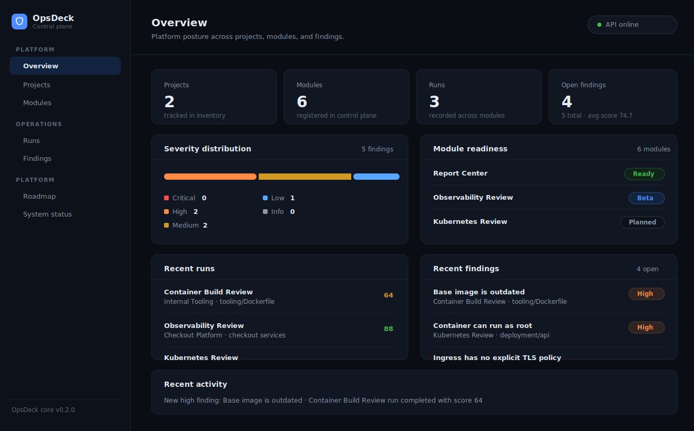
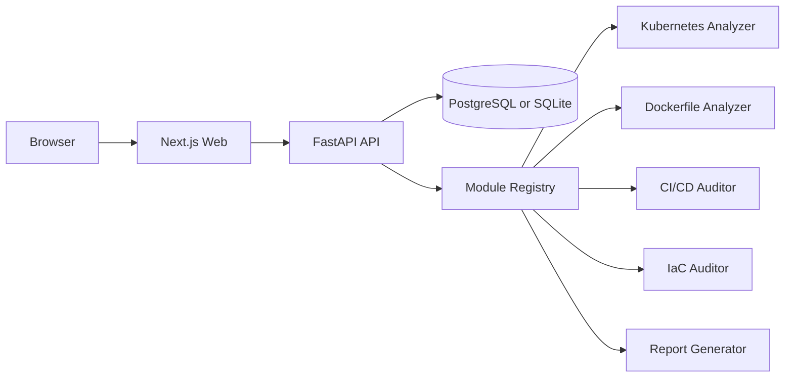
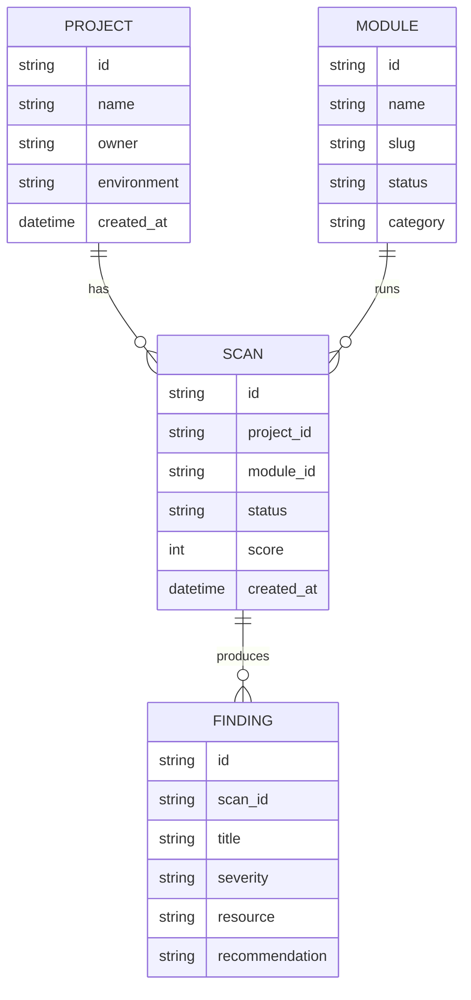

# OpsDeck

OpsDeck is the control room for a DevOps and DevSecOps platform. It is the first building block in a modular system that will later include Kubernetes analysis, Dockerfile review, CI/CD auditing, IaC checks, secrets and SBOM review, observability readiness, cloud posture checks, and report generation.

The goal is simple: give teams one calm place to see projects, scans, findings, module health, recent activity, and remediation progress.



## Why this project exists

DevOps work usually gets spread across dashboards, CI tools, cluster views, scanner output, Terraform state, incident notes, and spreadsheet-based reports. OpsDeck is the neutral control plane that brings those signals together.

This starter is intentionally production-shaped, not a throwaway demo. It includes a FastAPI backend, a Next.js frontend, SQLAlchemy models, Docker files, Docker Compose, seed data, health checks, and a README that Claude or another coding assistant can extend safely.

## Name

The name **OpsDeck** was chosen because it sounds like a normal engineering product rather than an AI-generated tool name. It suggests a deck, bridge, or control room where operators see the state of the system and act from one place.

The module vocabulary follows real DevOps language: projects, scans, findings, severity, modules, runbooks, CI/CD, Kubernetes, Terraform, Docker, observability, and cloud posture.

## Product scope

OpsDeck is the core platform. It does not try to perform every analysis itself. Instead, it provides the shared base that the later modules will plug into.

Current capabilities:

- Project inventory
- Module registry
- Scan history
- Findings database
- Severity summaries
- Module health view
- Recent activity feed
- FastAPI backend
- Next.js frontend
- PostgreSQL-ready persistence
- SQLite fallback for local quick start
- Docker Compose for local full-stack development

Planned modules that will integrate later:

- Kubernetes manifest analyzer
- Dockerfile analyzer
- CI/CD pipeline auditor
- Terraform and IaC auditor
- Secrets and SBOM reviewer
- Observability and runbook generator
- Cloud posture checker
- Report generator

## Architecture



## Repository layout

```text
opsdeck-core
├── apps
│   ├── api
│   │   ├── app
│   │   │   ├── api
│   │   │   ├── core
│   │   │   ├── db
│   │   │   ├── models
│   │   │   ├── schemas
│   │   │   └── services
│   │   ├── tests
│   │   ├── Dockerfile
│   │   └── requirements.txt
│   └── web
│       ├── app
│       ├── components
│       ├── lib
│       ├── Dockerfile
│       └── package.json
├── docs
│   └── images
├── docker-compose.yml
├── .env.example
└── README.md
```

## Quick start with Docker Compose

```bash
cp .env.example .env

docker compose up --build
```

Open:

```text
Frontend: http://localhost:3000
API:      http://localhost:8000
Docs:     http://localhost:8000/docs
Health:   http://localhost:8000/health
```

## Quick start without Docker

Start the API:

```bash
cd apps/api
python -m venv .venv
source .venv/bin/activate
pip install -r requirements.txt
uvicorn app.main:app --reload --host 0.0.0.0 --port 8000
```

Start the web app:

```bash
cd apps/web
npm install
npm run dev
```

Open:

```text
http://localhost:3000
```

## Environment variables

| Variable | Used by | Default | Purpose |
|---|---|---:|---|
| `DATABASE_URL` | API | `sqlite:///./opsdeck.db` | SQLAlchemy database URL |
| `APP_ENV` | API | `development` | Runtime environment label |
| `CORS_ORIGINS` | API | `http://localhost:3000` | Allowed frontend origins |
| `NEXT_PUBLIC_API_BASE_URL` | Web | `http://localhost:8000` | Browser-side API base URL |

## API overview

| Method | Path | Purpose |
|---|---|---|
| `GET` | `/health` | Service health |
| `GET` | `/api/overview` | Dashboard summary |
| `GET` | `/api/projects` | Project list |
| `POST` | `/api/projects` | Create project |
| `GET` | `/api/modules` | Registered modules |
| `GET` | `/api/scans` | Recent scans |
| `POST` | `/api/scans` | Create scan record |
| `GET` | `/api/findings` | Findings list |
| `POST` | `/api/findings` | Create finding |

## Data model



## Development workflow

Create a branch:

```bash
git checkout -b feature/opsdeck-core
```

Run checks:

```bash
cd apps/api
python -m pytest
python -m py_compile app/main.py

cd ../web
npm run lint
npm run build
```

Commit:

```bash
git add .
git commit -m "Add OpsDeck core platform"
```

Push:

```bash
git remote add origin https://github.com/YOUR_USER/opsdeck-core.git
git push -u origin feature/opsdeck-core
```

## How this should evolve

Suggested next steps:

1. Add authentication and workspace membership.
2. Add real migrations with Alembic.
3. Add module-to-module API contracts.
4. Add upload storage for manifests, Dockerfiles, and pipeline YAML.
5. Add report export to Markdown and HTML.
6. Add GitHub issue export.
7. Add background workers for long-running scans.
8. Add audit logging.
9. Add role-based access control.
10. Add a real deployment guide for Liara, Kubernetes, and Docker Compose.

## Claude handoff prompt

Use this prompt when sending the project to Claude:

```text
You are continuing the OpsDeck core platform. This repo is the shared control plane for a larger DevOps and DevSecOps portal. Keep the product name OpsDeck. Improve the codebase without turning it into a demo. Preserve the FastAPI backend, Next.js frontend, SQLAlchemy persistence, Docker Compose setup, and modular architecture. Add production-ready structure, stronger tests, better UI states, cleaner API contracts, and a path for future analyzer modules. Avoid hardcoded lab values. Keep README updates in English. Make the project feel like a real internal platform used by DevOps teams.
```

## Status

This is a complete starter core. It is ready to open in VS Code, run locally, push to GitHub, and then expand with the next module.
